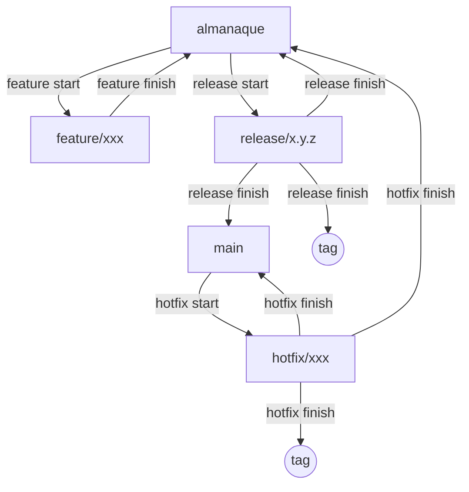

# 🧭 Calculadoras para Navegación  - Flujo de trabajo


Este repositorio utiliza **Git Flow** como modelo de ramificación para organizar el desarrollo. A continuación se describe detalladamente cómo trabajar correctamente con cada tipo de rama (`feature`, `release`, `hotfix`) en este proyecto.

> ✅ **Nota importante:** En este proyecto la rama de desarrollo principal se llama `almanaque` (en lugar de `develop`).

---

## 🔁 Flujo General de Trabajo



---

## 🧱 Tipos de ramas y cómo usarlas

### 1. `feature` — Para nuevas funcionalidades
- **Base:** `almanaque`
- **Objetivo:** `almanaque`
- **Descripción:** Se utiliza para desarrollar nuevas características o mejoras.

#### 🔧 Cómo usar:
```bash
git flow feature start nombre-feature
# ...trabaja, commitea...
git flow feature finish nombre-feature
```
Esto hace merge en `almanaque` y borra la rama feature.

---

### 2. `release` — Preparar versiones para producción
- **Base:** `almanaque`
- **Objetivo:** `main` y `almanaque`
- **Descripción:** Se utiliza cuando se quiere preparar un nuevo lanzamiento (release). Permite hacer pruebas, pequeños arreglos y documentar la versión.

#### 🔧 Cómo usar:
```bash
git flow release start vX.Y.Z
# ...ajustes finales, commits...
git flow release finish vX.Y.Z
```
Esto hace merge en `main`, `almanaque`, crea un `tag` y elimina la rama release.

> 🔁 **Importante:** Después del `release finish`, debes ejecutar:
```bash
git push origin main
git push origin almanaque
git push --tags
```

---

### 3. `hotfix` — Correcciones urgentes en producción
- **Base:** `main`
- **Objetivo:** `main` y `almanaque`
- **Descripción:** Se usa para corregir errores críticos en producción.

#### 🔧 Cómo usar:
```bash
git flow hotfix start nombre-hotfix
# ...solucionar el bug...
git flow hotfix finish nombre-hotfix
```
Esto hace merge en `main`, `almanaque`, crea un `tag` y elimina la rama hotfix.

> 🔁 **Importante:** Después del `hotfix finish`, recuerda:
```bash
git push origin main
git push origin almanaque
git push --tags
```

---

## ✅ Buenas prácticas
- Siempre asegúrate de estar en la rama correcta antes de crear una nueva rama con Git Flow.
- Usa nombres descriptivos para features y hotfixes.
- Realiza `push` después de cada `finish` ya que Git Flow no lo hace automáticamente.
- Si necesitas colaborar con otros, realiza `pull` frecuentemente en `almanaque`.

---

## 📌 Glosario
- **`almanaque`**: Rama principal de desarrollo (equivalente a `develop`).
- **`main`**: Rama estable usada para producción.
- **`feature/`**: Ramas de desarrollo de nuevas funcionalidades.
- **`release/`**: Ramas para preparación de lanzamientos.
- **`hotfix/`**: Ramas para correcciones urgentes en producción.

---

## 🚀 Conclusión
Así mantenemos el proyecto organizado y predecible. Siguiendo este flujo, podrás trabajar colaborativamente sin conflictos y con versiones controladas para desarrollo, testing y producción.
